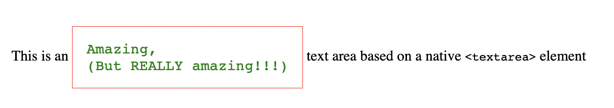

# React WrapTextArea 🌭
> a native `<textarea />` but that vertically and horizontally wraps the content
> thanks to good JS and CSS

```jsx
return (
    <p>
      This is an
      {' '}
      <WrapTextArea placeholder="undefined" />
      {' '}
      text area based on a native &lt;textarea&gt; element
    </p>
)
```

## Configuration

### Basic
```jsx
<WrapTextArea 
    value={anyText} 
    onChange={(e) => setAnyText(e.target.value)}
/>
```

### Styling


the `style` attribute can be used to style the component
```js
const style = {
    padding: 15,
    border: "solid 1px red",
    fontFamily: "Courier",
    verticalAlign: "middle",
    color: "green",
}

<WrapTextArea style={style} />
```

But the styling can also be applied to the container and the `<WrapTextArea />` will match it
```jsx
<p style={style}>
  {/* Inherits the styling of the parent */}
  <WrapTextArea />
</p>
```

### Sizing

```js
const style = { width: '100%' }

<table>
  <tr>
    <td>
      <WrapTextArea style={style}/>
    </td>
    <td>
      <WrapTextArea style={style}/>
    </td>
  </tr>
</table>
```

### DOM ref
(todo)

## Dev
Install peer dependencies for Storybook
```sh
npm run test
npm install --no-save react-dom webpack
npm run storybook
```
